##
# Quality Assurance Test For Amazing Superstore Power BI Analysis Using SQL

  
## Introduction

**Type of Data Set:**  Sales Dataset 

**Stakeholder Requirement / Problem Statement:** Create a Superstore database in MySql, write SQL queries, and create a test document to QA the Superstore Dashboard developed in Power BI Software.
1. Functional Validation: Test each feature as per the requirement. To verify all the filters and action filters on the report work as per the requirement
2. **Data Validation: Check the accuracy and quality of the data to match the value in the Power BI report with SQL queries.**
3. Test Document: Create a test document that will contain the screenshots and queries used to test the reports.

**Data Structure:** There are 2 tables in the dataset, which are named <kbd> Listoforders </kbd> and <kbd> Orderbreakdown </kbd>.

## Analysis Pipeline Using SQL Queries

**Data Source:** SharePoint

**Data Transformation/Cleaning:** Data cleaning and transformation were carried out using SQL Query.
#### 1. The dataset was on two different sheets and had to be made into a CSV file before being connected to MySQL database.
   
   **Vlookup** was extensively used for this transformation. This transformation was done on Excel before loading into MySql.
   
      **=VLOOKUP(lookup_value, table_array, Match, [range_lookup])**

##
   - Table 1 <kbd>ListOfOrders</kbd>
##
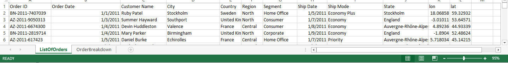
##
   -  Table 2 <kbd>OrderBreakdown</kbd>
##
   
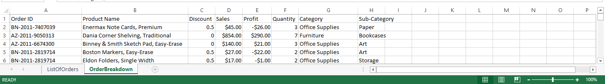

##
   -  <kbd>Merged_Table</kbd>
##
   
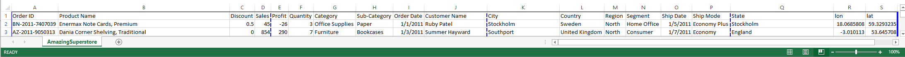

##
   -  **Coverted to CSV**
##

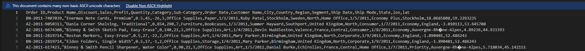

**The CSV File was connected to MYSQL Server**

##

#### 2. Date Function Transformation: Date Transformation was a must because we will be carrying out **Time Inetlligence Functions.**

The date is in the format of <kbd>DD-MM-YY</kbd> **Mysql** can only process dates in this format <kbd>YY-MM-DD.</kbd> 
Therefore, date conversion is inevitable.
This query is a modification query.

         use amazingmart;
         SELECT * FROM amazingsuperstore;
         alter table amazingsuperstore modify column `Order Date` varchar(20);
         alter table amazingsuperstore modify column `Ship Date` varchar(20);
         desc amazingsuperstore;
         update amazingsuperstore set `Order Date` = str_to_date(`Order Date`, '%m/%d/%Y');
         select date_format(str_to_date(`Order Date`, '%m/%d/%Y'), '%d/%m/%Y') as dateformat from amazingsuperstore;

         update amazingsuperstore set `Ship Date` = str_to_date(`Ship Date`, '%m/%d/%Y');
         select date_format(str_to_date(`Ship Date`, '%m/%d/%Y'), '%d/%m/%Y') as dateformat from amazingsuperstore;
         SELECT * FROM amazingsuperstore;

 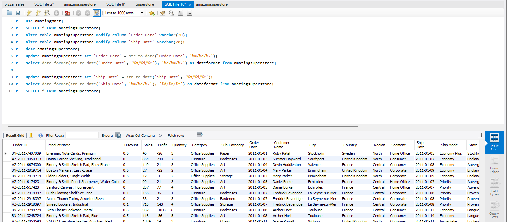

  
## Analysis

**Data Validation: QA check for the Power BI live report with SQL queries.**

For Live Visualization click here <kbd>[Live-Visualization](https://app.powerbi.com/view?r=eyJrIjoiMzczYjA0YzItYTgzZi00MTk0LTk4ZTYtN2U4MDdjYzk2ZjQ3IiwidCI6IjU0OGU5MDRlLTY2MDEtNGQ0My1iZmY3LTYzZGRlZTRjOWVlNiJ9&pageName=ReportSectiona0423d4498c17d5c245d)</kbd>
  

**SQL Software:** MySQL
##
### A. KPI
##
 **1. Total Order** 

     select count(`Order ID`) as Total_Order from amazingsuperstore;
     
**Output:**

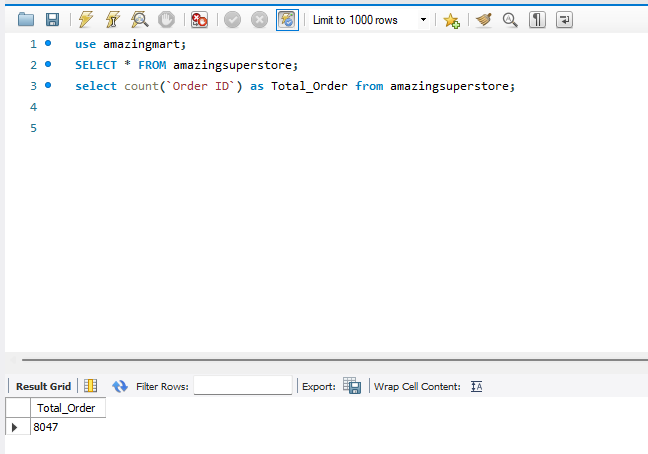
##
 **2. Total Sales** 

     select sum(Sales) as Total_Sales from amazingsuperstore;
     
**Output:**

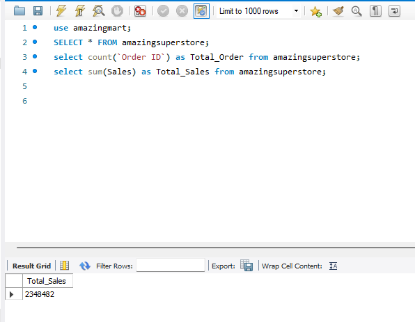

##
 **3. Total Profit** 

     select sum(Profit) as Total_Profit from amazingsuperstore;
     
**Output:**

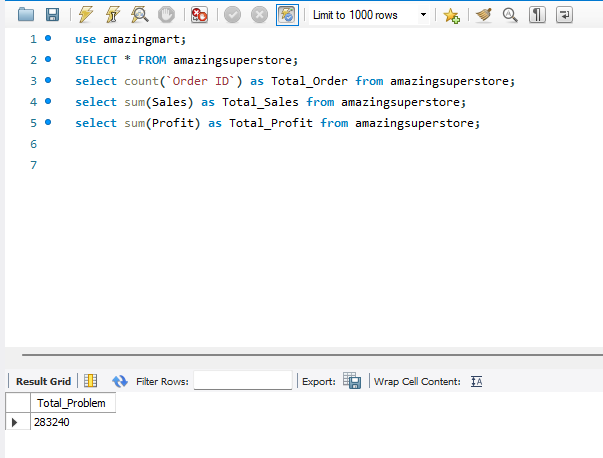

##
 **4. Percentage Profit** 

     select round((sum(Profit) / sum(Sales) ) * 100, 0) as Percentage_Profit FROM amazingsuperstore; 
     Converted to 0 decima
     
**Output:**

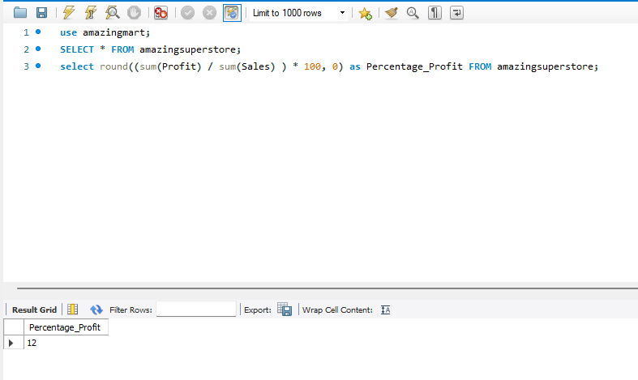

##
### B. Product Category
##
 **5. Office Supply** 

     select count(`Order ID`) as Office_Supplies from amazingsuperstore where Category='Office Supplies';
     
**Output:**

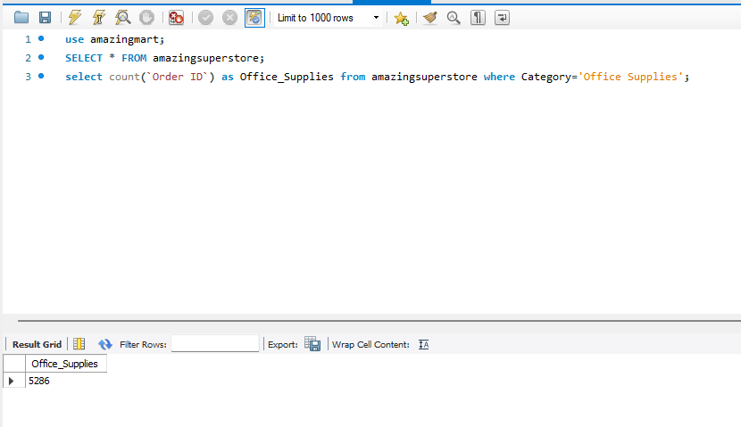

##
 **6. Furniture** 

     select count(`Order ID`) as Office_Supplies from amazingsuperstore where Category='Furniture';
     
**Output:**

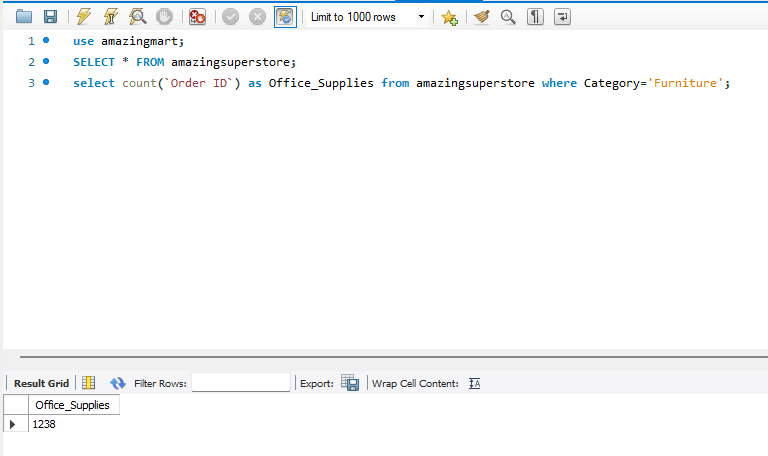

##
 **7. Technology** 

     select count(`Order ID`) as Office_Supplies from amazingsuperstore where Category='Technology';
     
**Output:**

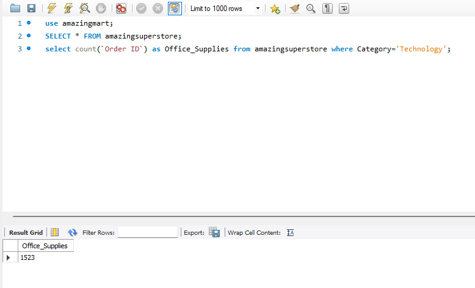

##
### C. Performance by Year
##
 **8. Total Order by Year** 

     select count(`Order ID`) as Office_Supplies from amazingsuperstore where Category='Office Supplies';
     
**Output:**

