##
# Quality Assurance Test For Amazing Superstore Power BI Analysis Using SQL

  
## Introduction

**Type of Data Set:**  Sales Dataset 

**Stakeholder Requirement / Problem Statement:** Create a Superstore database in MySql, write SQL queries, and create a test document to QA the Superstore Dashboard developed in Power BI Software.
1. Functional Validation: Test each feature as per the requirement. To verify all the filters and action filters on the report work as per the requirement
2. **Data Validation: Check the accuracy and quality of the data to match the value in the Power BI report with SQL queries.**
3. Test Document: Create a test document that will contain the screenshots and queries used to test the reports.

**Data Structure:** There are 2 tables in the dataset, which are named <kbd> Listoforders </kbd> and <kbd> Orderbreakdown </kbd>.

## Analysis Pipeline Using SQL Queries

**Data Source:** SharePoint

**Data Transformation/Cleaning:** Data cleaning and transformation were carried out using SQL Query.
#### 1. The dataset was on two different sheets and had to be made into a CSV file before being connected to the MySQL database.
   
   **Vlookup** was extensively used for this transformation. This transformation was done on Excel before loading into MySQL.
   
      =VLOOKUP(lookup_value, table_array, Match, [range_lookup])

##
   - Table 1 : The table name is <kbd>ListOfOrders</kbd>
##

##
   -  Table 2: The table name is <kbd>OrderBreakdown</kbd>
##
   

##
   -  <kbd>Merged_Table</kbd> The two tables above are merged into one.
##
   

##
   -  **The Merged table was Converted to CSV**
##

**The CSV File was connected to MYSQL database Server**

##

#### 2. Date Function Transformation: This is neccessary for **Time Inetlligence Functions.**

The date is in the format of <kbd>DD-MM-YY</kbd>.   **Mysql** can only process dates in this format <kbd>YY-MM-DD.</kbd>  
Therefore, date conversion is inevitable. 
This query is a modification query.

         use amazingmart;
         SELECT * FROM amazingsuperstore;
         alter table amazingsuperstore modify column `Order Date` varchar(20);
         alter table amazingsuperstore modify column `Ship Date` varchar(20);
         desc amazingsuperstore;
         update amazingsuperstore set `Order Date` = str_to_date(`Order Date`, '%m/%d/%Y');
         select date_format(str_to_date(`Order Date`, '%m/%d/%Y'), '%d/%m/%Y') as dateformat from amazingsuperstore;

         update amazingsuperstore set `Ship Date` = str_to_date(`Ship Date`, '%m/%d/%Y');
         select date_format(str_to_date(`Ship Date`, '%m/%d/%Y'), '%d/%m/%Y') as dateformat from amazingsuperstore;
         SELECT * FROM amazingsuperstore;

 

  
## Analysis

**Data Validation: QA check for the Power BI live report with SQL queries.**

For Power BI Live Visualization click here <kbd>[Live-Visualization](https://app.powerbi.com/view?r=eyJrIjoiMzczYjA0YzItYTgzZi00MTk0LTk4ZTYtN2U4MDdjYzk2ZjQ3IiwidCI6IjU0OGU5MDRlLTY2MDEtNGQ0My1iZmY3LTYzZGRlZTRjOWVlNiJ9&pageName=ReportSectiona0423d4498c17d5c245d)</kbd>
  

**SQL Software:** MySQL
##
### A. KPI
##
 **1. Total Order** 

     select count(`Order ID`) as Total_Order from amazingsuperstore;
     
**Output:**

##
 **2. Total Sales** 

     select sum(Sales) as Total_Sales from amazingsuperstore;
     
**Output:**

##
 **3. Total Profit** 

     select sum(Profit) as Total_Profit from amazingsuperstore;
     
**Output:**

##
 **4. Percentage Profit** 

     select round((sum(Profit) / sum(Sales) ) * 100, 0) as Percentage_Profit FROM amazingsuperstore; 
     Converted to 0 decima
     
**Output:**

##
### B. Product Category
##
 **5. Office Supply** 

     select count(`Order ID`) as Office_Supplies from amazingsuperstore where Category='Office Supplies';
     
**Output:**

##
 **6. Furniture** 

     select count(`Order ID`) as Office_Supplies from amazingsuperstore where Category='Furniture';
     
**Output:**

##
 **7. Technology** 

     select count(`Order ID`) as Office_Supplies from amazingsuperstore where Category='Technology';
     
**Output:**

##
### C. Performance by Year
##
 **8. Total Order by Year** 

     select   year(`Order Date`) as Year, count(`Order ID`) as Total_order from amazingsuperstore group by year(`Order Date`);
     
**Output:**

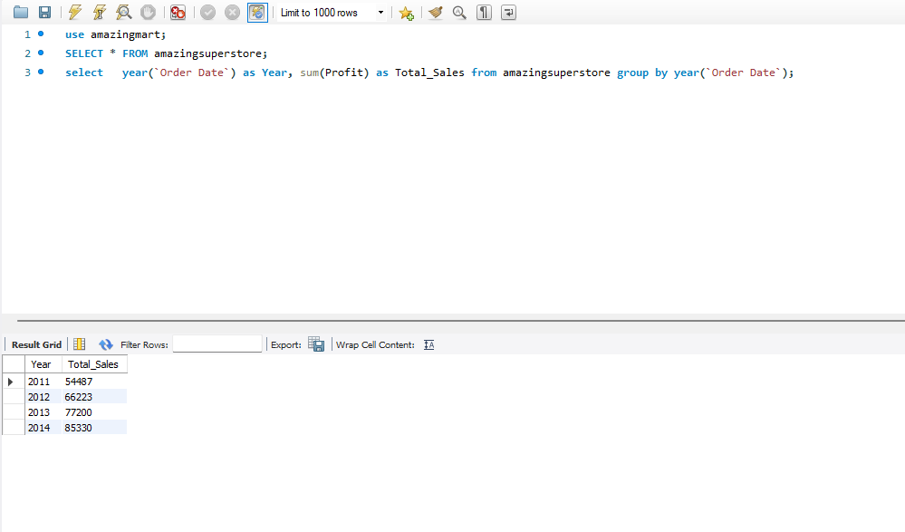

##
 **9. Total Sales by Year** 

     select   year(`Order Date`) as Year, sum(Sales) as Total_Sales from amazingsuperstore group by year(`Order Date`);
     
**Output:**

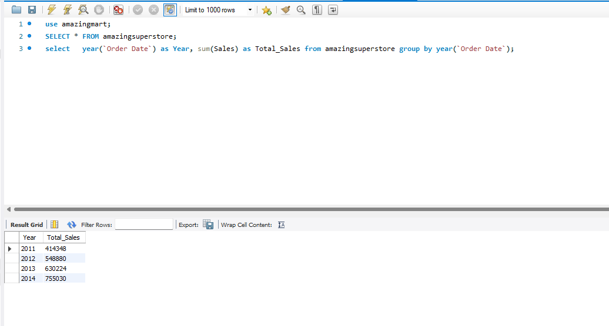

##
 **10. Total Profit by Year** 

     select   year(`Order Date`) as Year, sum(Profit) as Total_Sales from amazingsuperstore group by year(`Order Date`);
     
**Output:**

##
 **11. Cost of Sales by Year** 

     Calculating cost of sales
     
     select   year(`Order Date`) as Year,  (sum(Sales) - sum(Profit)) as Cost_of_sales from amazingsuperstore group by year(`Order Date`);

     
**Output:**

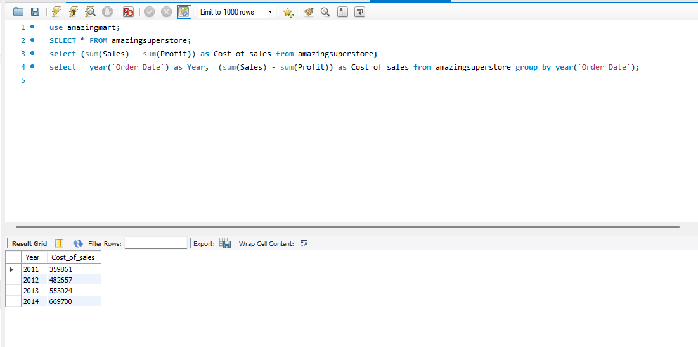

##
 **12. Year on Year Growth** 

Calculating cost of sales
     
     select year(`Order Date`) as Current_Year, sum(profit) as Total_Profit from amazingsuperstore group by  year(`Order Date`);
     select sum(profit) as Total_Profit from amazingsuperstore where  year(`Order Date`)='2011';
     select sum(profit) as Total_Profit from amazingsuperstore where  year(`Order Date`)='2012';
     select sum(profit) as Total_Profit from amazingsuperstore where  year(`Order Date`)='2013';
     select sum(profit) as Total_Profit from amazingsuperstore where  year(`Order Date`)='2014'; 

Year on Year Growth for year 2012:
 
     select round( (sum(profit) / (select sum(profit) as Total_Profit from amazingsuperstore where  year(`Order Date`)='2011') - 1) * 100, 2) as YOY_Growth  
     from amazingsuperstore where  year(`Order Date`)='2012';
     
**Output:**

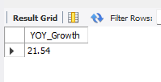

Year on Year Growth for year 2013:
     
     select round( (sum(profit) / (select sum(profit) as Total_Profit from amazingsuperstore where  year(`Order Date`)='2012') - 1) * 100, 2) as YOY_Growth  
     from amazingsuperstore where  year(`Order Date`)='2013';

**Output:**

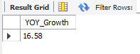

Year on Year Growth for year 2014:

     select round( (sum(profit) / (select sum(profit) as Total_Profit from amazingsuperstore where  year(`Order Date`)='2013') - 1) * 100, 2) as YOY_Growth  
     from amazingsuperstore where  year(`Order Date`)='2014';

     
**Output:**

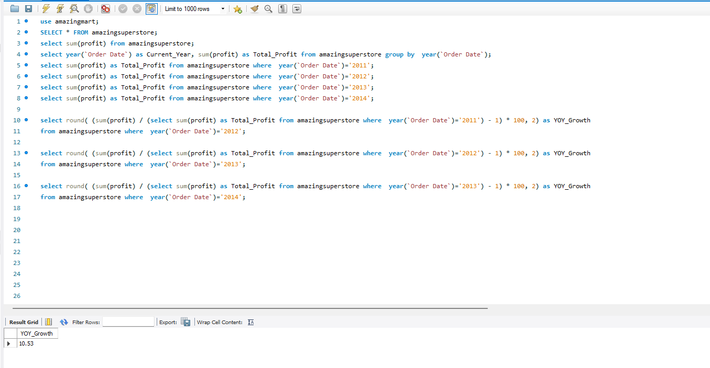

##
### D. Profit with or without Discount
##
 **13. Profit with Discount** 

     select sum(Profit) as Profit_before_Discount FROM amazingsuperstore;

     
**Output:**

##
 **14. Profit without Discount**  

**Statistics:**  
cost of sales = Selling price - Profit 
Selling price before discount = selling Price / (1 - discount) 
The Discount is in decimals, that is why am using 1 and not 100 
Profit without discount = Selling price before Discount - Cost of Sales 

**Cost of sales:**

      select  sum(`Sales` - `Profit`) as Cost_of_Sales FROM amazingsuperstore;

     
**Output:**

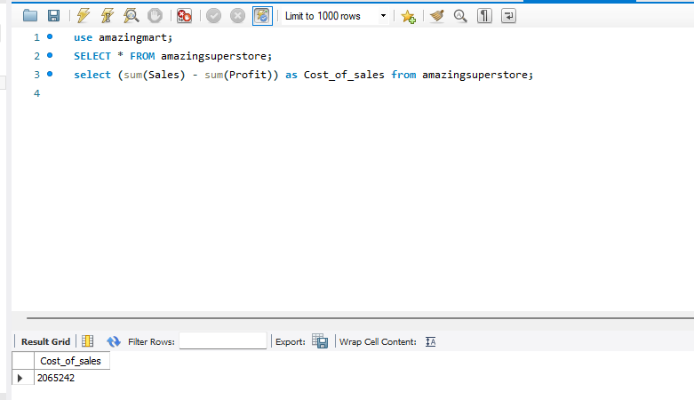

**Selling Price before Discount:**

    select  sum(`Sales` / (1 - `Discount`)) as Price_Before_Discount FROM amazingsuperstore;

**Output:**

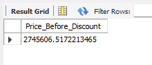

**Profit before discount:**

     select  round( sum(`Sales` / (1 - `Discount`)) - sum(`Sales` - `Profit`)  , 0) as Profit_before_Discount FROM amazingsuperstore;

**Output:**

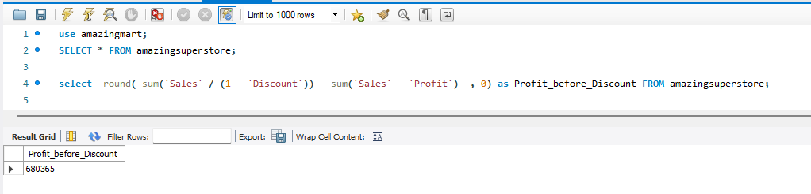

##
 **15. Percentage Profit without Discount** 

    select  round( ((sum(`Sales` / (1 - `Discount`)) - sum(`Sales` - `Profit`)) / sum(sales)) * 100, 0) as Profit_before_Discount FROM amazingsuperstore;
     Converted to 0 decima
     
**Output:**

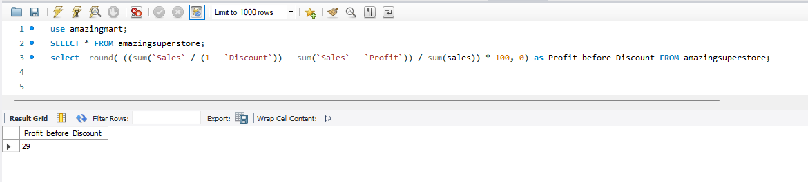

##
### E. Profit Comparism
##
 **16. Percentage of Profit with Discount to Profit without Disco** 

    select  round( ( sum(Profit) / ( sum(`Sales` / (1 - `Discount`)) - sum(`Sales` - `Profit`) )) * 100, 1) as Profit_before_Discount FROM amazingsuperstore;
     Converted to 0 decima
     
**Output:**

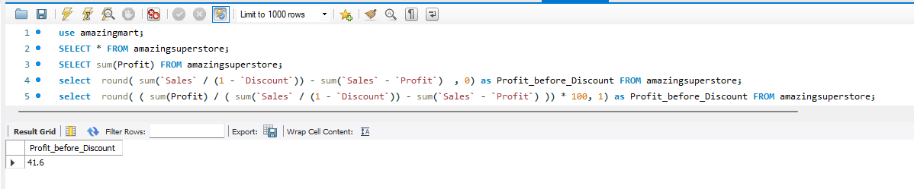

##
### F. Profit With & Without Discount By Year
##
 **17. Profit with Discount by Year** 

    select  year(`Order Date`) as Year, sum(Profit) as Profit_before_Discount FROM amazingsuperstore group by  year(`Order Date`);
     
**Output:**

##
 **18.Profit Without Discount by Year** 

    select year(`Order Date`) as Year,  round( sum(`Sales` / (1 - `Discount`)) - sum(`Sales` - `Profit`)  , 0) as Profit_before_Discount FROM amazingsuperstore group by year(`Order Date`) ;
     
**Output:**

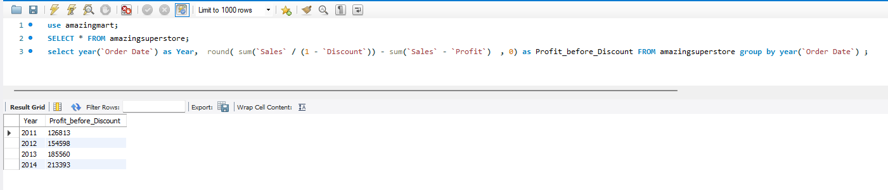

##
### G. Profit by Discount
##
 **19. Profit by Discount** 

    select  `Discount`, sum(Profit) as Profit FROM amazingsuperstore group by `Discount` order by `Discount` asc;
     
**Output:**

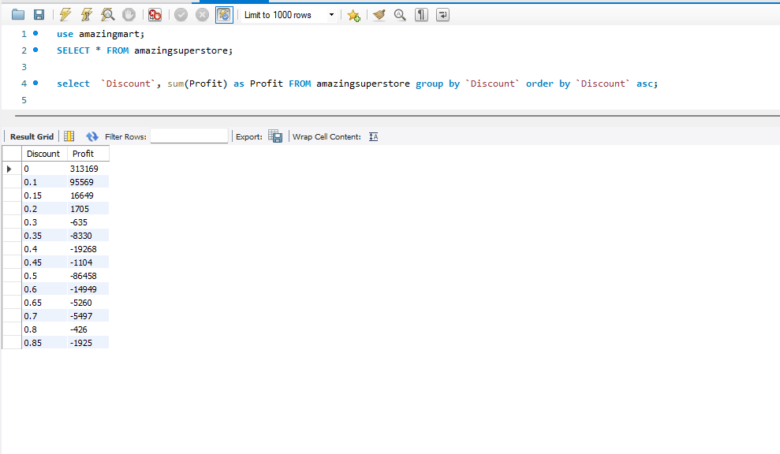

##
 **20. Profit made from <= 20% Discount sales** 

    select  sum(Profit) as Profit FROM amazingsuperstore where `Discount` between 0 and 0.2;
     
**Output:**

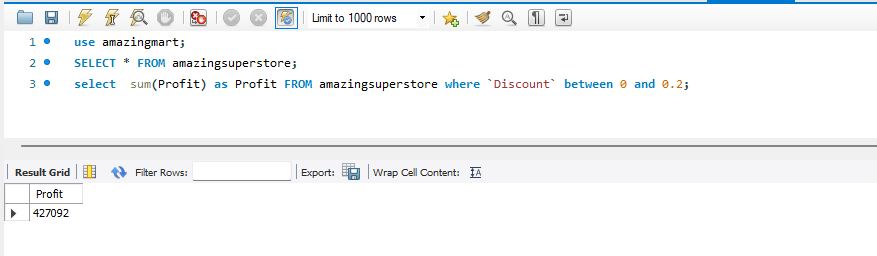

##
 **21. Total Number from <= 20%** 

    select count(`Order ID`) as Profit FROM amazingsuperstore where `Discount` between 0 and 0.2;
     
**Output:**

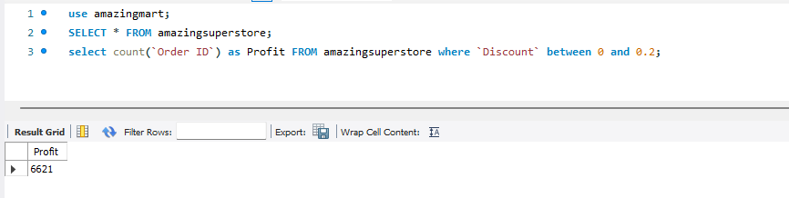

##
 **22. Profit made from >= 30% Discount sales** 

    select  sum(Profit) as Profit FROM amazingsuperstore where `Discount` between 0.3 and 1;
     
**Output:**

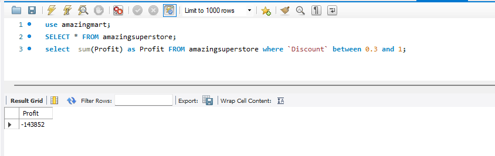

##
 **23. Total Number of Order >= 30%** 

    select  sum(Profit) as Profit FROM amazingsuperstore where `Discount` between 0.3 and 1;
     
**Output:**

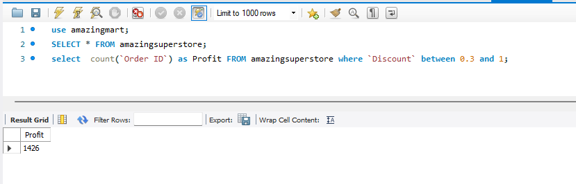

##
### H.19 Total Order, Profit and Max Discount by Country
##
 

     select Country, count(`Order ID`) as Total_Order , sum(Profit) as Profit, max(Discount) as Max_Discount FROM amazingsuperstore group by Country order by sum(Profit) desc ;
     

**Output:**

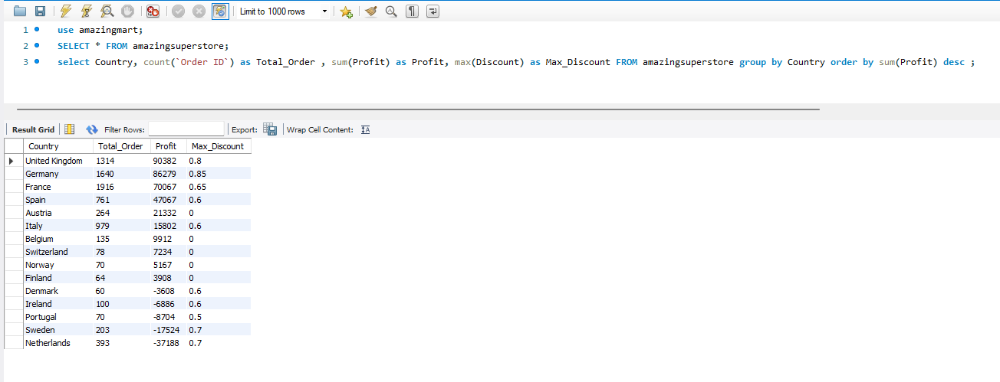

##
### I.20 Discount by Profit
##
 

     select  Discount, sum(Profit) as Profit FROM amazingsuperstore group by Discount order by Discount asc;
     

**Output:**

##
### Result: The report is quality assured.
##
